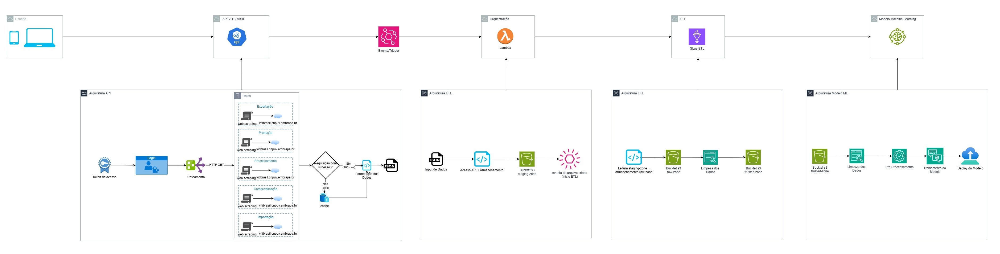

# Arquitetura
 

# Executar localmente
uvicorn app.main:app --reload

# Executar testes
pytest tests/ -v  # "-v" para modo verboso

# Testar autenticação
curl -H "Authorization: Bearer TOKEN" http://localhost:8000/api/producao

# Documentação Automática
A FastAPI gera automaticamente documentação interativa:

Swagger UI: http://localhost:8000/docs
ReDoc: http://localhost:8000/redoc
