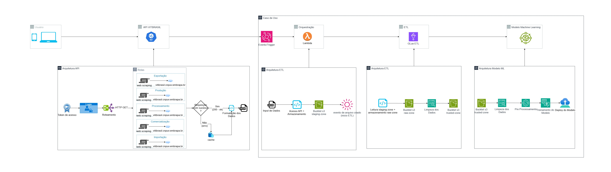

# API EMBRAPA

Link para o `video explicativo da api` e seu desenvolvimento
https://drive.google.com/file/d/1RdPXZwYWWSxSumIwnTnD4O4jX7k8ql-v/view?usp=sharing


# Sobre a API
Esta é uma API RESTful desenvolvida com o framework FastAPI, que fornece acesso
aos dados públicos disponibilizados pelo site da Embrapa Vitibrasil, especificamente 
nas áreas de produção, processamento, comercialização, importação e exportação de uvas e 
derivados no Brasil. A API realiza a extração e estruturação automática dessas 
informações, permitindo consultas filtradas por ano e por categoria específica, 
como tipo de uva ou produto (vinhos de mesa, espumantes, suco de uva, etc.). 
Com essa API, é possível integrar dados atualizados em aplicações externas,
realizar análises estatísticas ou alimentar modelos preditivos com maior 
praticidade e confiabilidade.

O foco principal do projeto é usar esses dados pra alimentar um modelo de 
machine learning que consiga prever os melhores períodos e destinos internacionais 
pra exportação de vinhos brasileiros. Com os dados históricos acessíveis via API, 
dá pra identificar padrões de exportação por país, tipo de vinho e sazonalidade. 
Isso pode ajudar muito quem trabalha com vinícolas a planejar melhor suas remessas 
e até ajustar campanhas de marketing pra cada mercado. Além disso, dá pra integrar 
essa API em outras aplicações, relatórios, dashboards ou até mesmo em modelos 
preditivos mais complexos.

# Autenticação
Para acessar a API, primeiro você precisa se cadastrar pra conseguir seu login e senha. 
Depois disso, é só enviar essas credenciais pro endpoint /login, e você vai receber 
um token JWT. 
Esse token precisa ser enviado no cabeçalho das suas requisições pra acessar os 
dados protegidos. Essa etapa de autenticação serve pra garantir que só usuários 
cadastrados tenham acesso aos dados estruturados da Embrapa Vitibrasil.

# Pare Executar localmente


1- Clone o repositório
```shell
    git clone https://github.com/seu-usuario/seu-repositorio.git
    cd seu-repositorio
```

2- Crie o arquivo .env a partir do .env.example
```shell
    cp .env.example .env
```

3- Crie um ambiente virtual (opcional, mas recomendado)
```shell
    python -m venv venv
    source venv/bin/activate  # Linux/Mac
    .\venv\Scripts\activate    # Windows
```
4- Instale as dependências
```shell
    pip install -r requirements.txt
```
5- Rode a API
```shell
    uvicorn app.main:app --reload 
```
6- Para rodar os testes
```shell
    pytest tests/ -v
```
# Documentação Automática
A FastAPI gera automaticamente documentação interativa:

Swagger UI: http://localhost:8000/docs

ReDoc: http://localhost:8000/redoc

# Acesso do projeto em Produção
[API fase 1](https://fase-1-hkv8.onrender.com/docs#/Login/register_api_register_post)


# Arquitetura
 

A arquitetura começa pela API, após se cadastrar e logar, voce recebe um token JWT.
Esse token é usado para acessar os endpoints protegidos da API, cada rota corresponde
a uma área específca do site da Embrapa, são elas: produção, exportação, importação,
comercialização e processamento.
Ao chamar um endpoint, a API acessa a página correspondente, extrai os dados de 
forma automatizada, realiza o parsing e retorna um JSON estruturado.
A cada chamada bem-sucedida, a API salva automaticamente o retorno em cache local,
caso uma futura requisição à mesma rota falhe, a API retorna o último arquivo salvo, 
garantindo maior resiliência e disponibilidade dos dados.

Seguindo a arquitetura do caso de uso, após chamar a API por uma lambda com um evento como start do trigger,
e obter o resultado em json, esses dados são salvos no bucket s3 na camada staging, seguindo para
o evento de ETL com aws glue, onde os dados passam por transformação, limpeza e organização, 
passando pela camada raw e estacionando na camada trusted. 
A camada trusted serve como fonte de alimentação do modelo de machine learning, que processa os dados, 
usa para treinamento e 
A camada trusted alimenta o modelo de machine learning, que prevê os melhores períodos e destinos 
para exportação de vinhos. Os dados passam por pré-processamento, o modelo é treinado com 
base em padrões históricos e depois implantado em produção, 
gerando previsões atualizadas conforme novos dados chegam.


# Estrutura da API
```text
app/
├── main.py                # Ponto de entrada da API (FastAPI app)
├── config.py              # Configurações da aplicação (variáveis de ambiente, constantes)
├── __init__.py            # Inicialização do pacote principal
├── auth/                  # Lógica de autenticação JWT
│   ├── __init__.py
│   ├── models/
│   │   ├── __init__.py
│   │   └── user.py
│   ├── routes/
│   │   ├── __init__.py
│   │   ├── login.py
│   │   └── register.py
│   └── schemas/           # Includes login, token creation, and security dependencies
│       ├── __init__.py
│       ├── dependencies.py
│       ├── jwt_handler.py
│       ├── password_handler.py
│       └── token.py
├── models/                # Schemas Pydantic para validação dos dados
│   ├── __init__.py
│   └── responses.py
├── routes/                # Rotas da API organizadas por domínio (produção, importação etc)
│   ├── __init__.py
│   ├── producao.py
│   ├── importacao.py
│   ├── exportacao.py
│   ├── comercializacao.py
│   └── processamento.py
├── scrapers/              # Scripts de scraping que acessam e estruturam os dados do site
│   ├── __init__.py
│   ├── base_scraper.py
│   ├── producao_scraper.py
│   ├── importacao_scraper.py
│   ├── exportacao_scraper.py
│   ├── comercializacao_scraper.py
│   └── processamento_scraper.py
└── utils/                 # Funções auxiliares (validação, formatação, helpers em geral)
    ├── __init__.py
    └── helpers.py
```


Desenvolvido por:
- RM364306-Lucas Felipe de Jesus Machado
- RM364480-Antônio Teixeira Santana Neto
- RM364538-Gabriela Moreno Rocha dos Santos
- RM364379-Erik Douglas Alves Gomes
- RM364648-Leonardo Fernandes Soares
